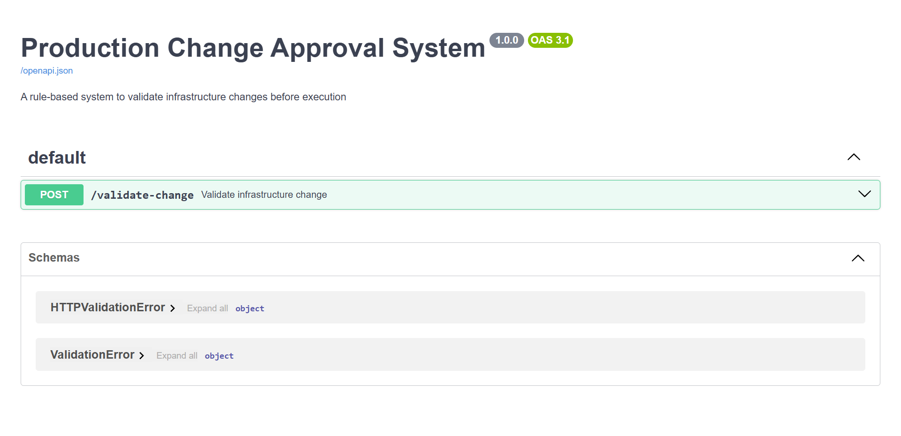
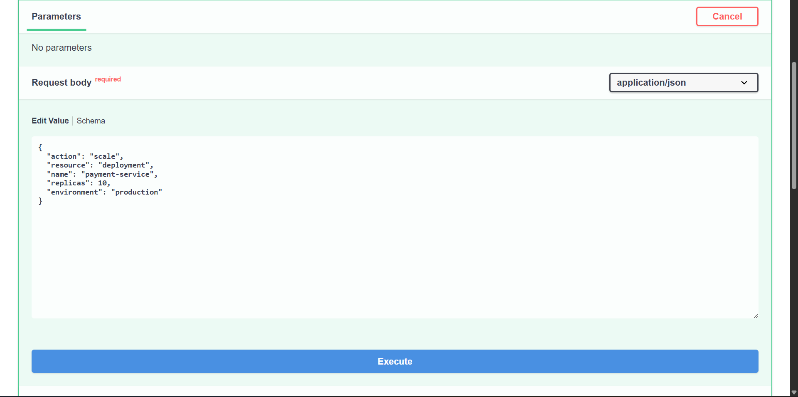
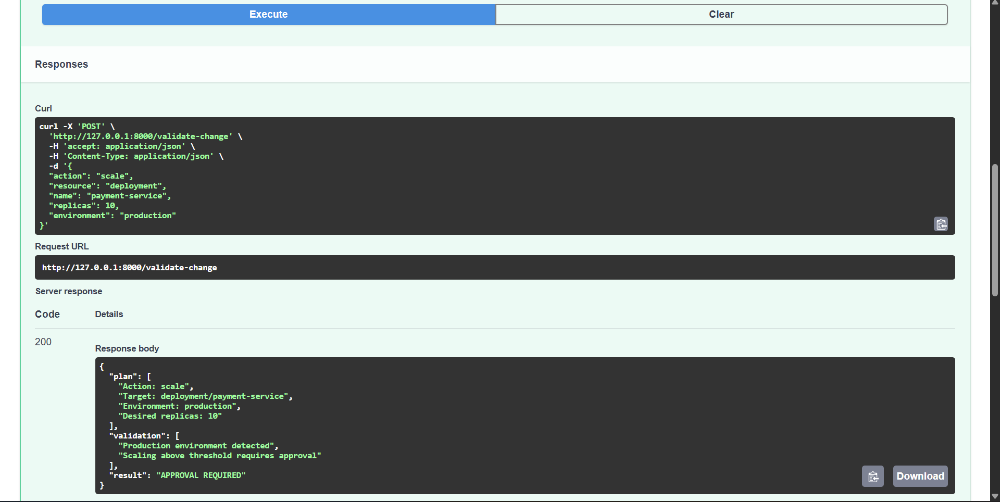

# Production Change Approval System


### Request Example



### Validation Result



A rule-based system for validating infrastructure change requests before deployment. It demonstrates how production changes can be evaluated against predefined approval rules.

## Features

- Rule-based infrastructure change validation
- Supports three outcomes:
  - AUTO-APPROVED
  - APPROVAL REQUIRED
  - BLOCKED
- REST API built with FastAPI
- Interactive API testing using Swagger UI
- Command-line validation using YAML input

## Tech Stack

- Python
- FastAPI
- PyYAML
- Uvicorn

## Project Structure

```
main.py              # FastAPI application
change_gate.py       # Validation logic
test.yaml            # Sample input
requirements.txt
```

## Installation

```bash
pip install -r requirements.txt
```

## Run the API

```bash
python -m uvicorn main:app --reload
```

Open:

```
http://127.0.0.1:8000/docs
```

to test the API using Swagger UI.

## Run from Command Line

```bash
python change_gate.py test.yaml
```

## Sample Result

Depending on the request, the system returns one of the following:

- AUTO-APPROVED
- APPROVAL REQUIRED
- BLOCKED
## Author

Pushkar Kadam
